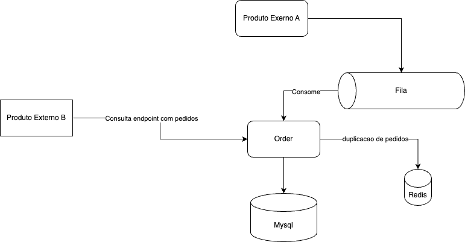

# Sistema de Gestão de Pedidos

Um **Sistema de Gestão de Pedidos** desenvolvido com **Spring Boot**, **Redis**, **MySQL**, **RabbitMQ** e **Docker**, projetado para lidar com altos volumes de processamento de pedidos de forma eficiente.

---

## **Recursos**

- **Processamento de Pedidos**:
    - Processamento em lote de pedidos pendentes.
    - Validação e tratamento de erros para pedidos com falhas.
- **APIs**:
    - APIs RESTful para listar, criar e atualizar pedidos.
- **Integração**:
    - Mensageria com RabbitMQ para processamento assíncrono.
    - Redis para cache e deduplicação.
- **Tarefas Agendadas**:
    - Processamento automático de pedidos pendentes a cada minuto.
- **Implantação Escalável**:
    - Configurado para Docker Compose com Redis, MySQL e RabbitMQ.

---

## **Como Começar**

### **Pré-requisitos**

Certifique-se de ter instalado:

- **Java 17**
- **Maven**
- **Docker** & **Docker Compose**

---

### **Configuração do Projeto**

1. **Clone o Repositório**:

   ```bash
   git clone https://github.com/seuusuario/sistema-gestao-pedidos.git
   cd sistema-gestao-pedidos
   ```
2. **Compile o Projeto**:

    ```bash 
    mvn clean package
    ```
    
3. **Execute com Docker Compose**:
     ```bash 
    docker-compose up --build
     ```

### Endpoints da API

URL Base: http://localhost:8080/api/v1/pedidos

```
    GET /api/v1/pedidos?page=0&size=10&sortBy=id&sortDirection=ASC&status=PENDENTE
```

### Arquitetura


Camada de Controladores:
Gerencia as requisições HTTP e retorna respostas.

Camada de Serviços:
Contém a lógica de negócio para o processamento e validação de pedidos.
Camada de Repositórios:
Comunicação com o banco de dados MySQL.

Mensageria:
Utiliza RabbitMQ para processamento assíncrono.

Cache:Implementa Redis para deduplicação e cache.

### Configurações

Variáveis de Ambiente

| Variável                   | Valor Padrão                    | Descrição               | 
|----------------------------|---------------------------------|-------------------------|
| SPRING_DATASOURCE_URL      | jdbc:mysql://mysql:3306/orderdb | URL do banco MySQL.     |
| SPRING_DATASOURCE_USERNAME | root                            | Usuário do banco MySQL. |
| SPRING_DATASOURCE_PASSWORD | 	root                           | 	Senha do banco MySQL.  |
| SPRING_RABBITMQ_HOST       | 	rabbitmq                       | Hostname do RabbitMQ.   |
| SPRING_REDIS_HOST          | 	redis	                         | Hostname do Redis.      |

###  Tecnologias Utilizadas

1. Backend: Spring Boot
2. Mensageria: RabbitMQ
3. Banco de Dados: MySQL
4. Cache: Redis
5. Containerização: Docker Compose

### Desenvolvimento

Executar Localmente:
```  bash
mvn spring-boot:run
```
Testes
Testes Unitários:

Execute os testes com:
```bash
mvn test
```
